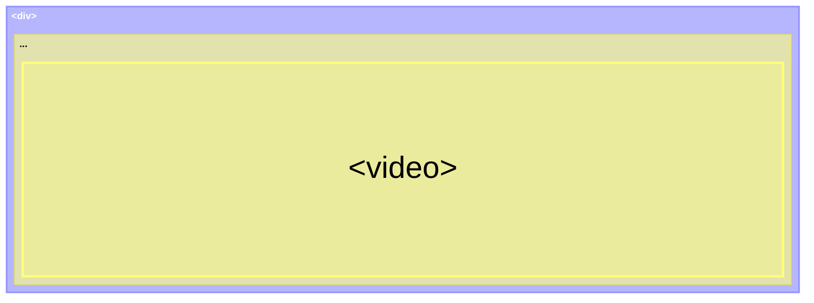
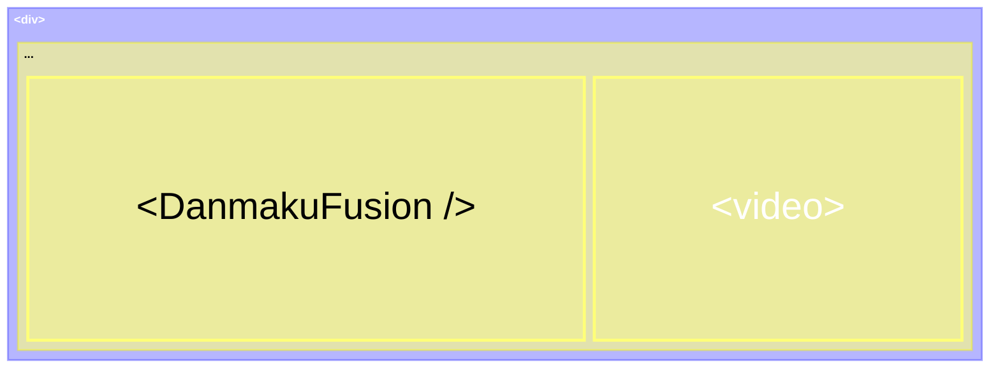
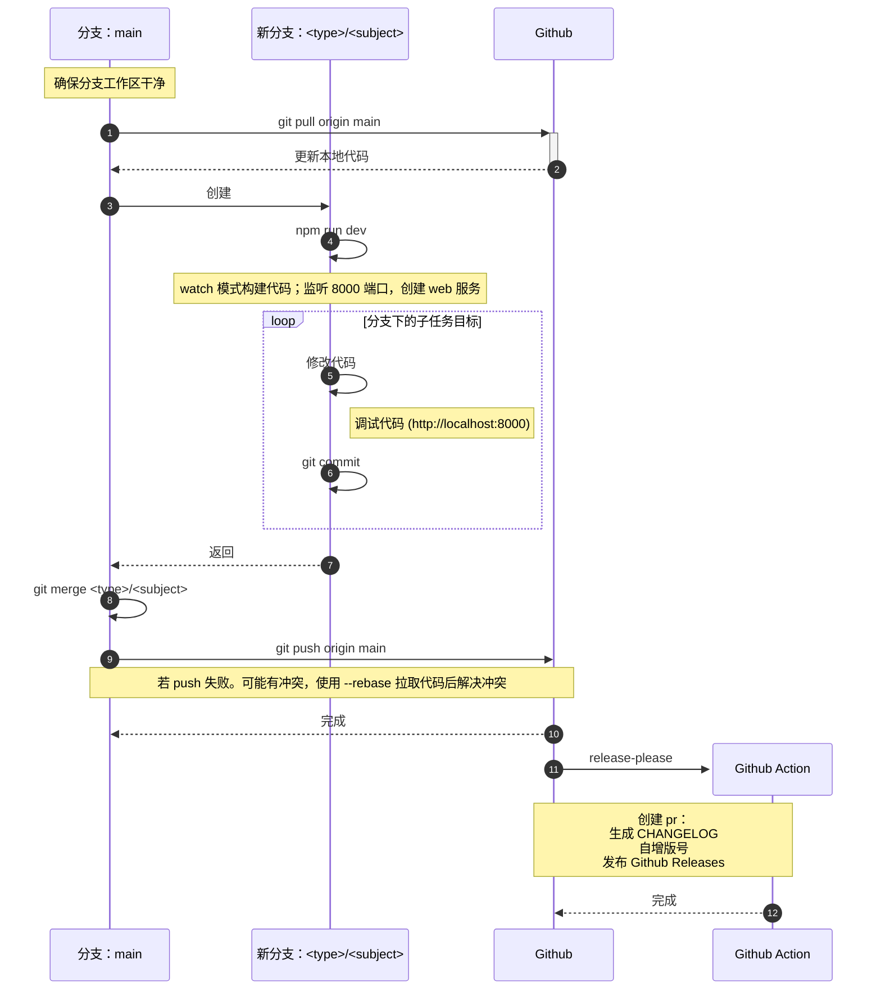

# 贡献指南 For Author

## 开发前

确保开发环境已安装：

- nodejs >= v20.19.6；

- pnpm >= 10.17.1；

## 书写惯例

### 原始网页

当前脚本注入第三方视频网站提供增强体验，而这个第三方视频网站成为*原始网页*。

### 视频区块

如下图，[视频容器](#视频容器)与 `<video>`组成的结构称为视频区块。`<video>`与视频容器的关系：父子或祖先与后代。



#### 视频容器

`<video>` 的任意祖先容器，只要符合改变容器尺寸，video 的尺寸随之改变且铺满的，都可作为[视频容器](#视频容器)，与 video 组成[视频区块](#视频区块)结构。

### 弹幕视频区块

在视频区块的基础上，插入 `video` 的兄弟节点`<DanmakuFusion />`即是*弹幕视频区块*。`<DanmakuFusion />`的功能是注入[原始网页](#原始网页)，提供弹幕能力的 JSX 组件。



## 安装依赖

```shell
pnpm install
```

## 运行

开发模式，运行项目。将在 watch 模式下启动本地 web 服务，其根目录是 `./dev`，监听 `8000` 端口。

```shell
$ npm run dev

> danmaku-syringe@1.0.0 dev
> NODE_ENV=development node esbuild.config.js

> http://localhost:8000/
```

watch 模式监听以 `./dev/index.js`（[调试模块](#调试模块)） 和 `./index.js`（[业务模块](#业务模块)） 为入口的代码变动，构建得到产物：

```shell
./dev/dist
├── byproduct.js      # ./dev/index.js
├── byproduct.js.map
├── index.js          # ./index.js
└── index.js.map
```

`./dev/index.html`先后引入`byproduct.js` 和 `index.js`：

```html
<script src="./dist/byproduct.js"></script>
<script src="./dist/index.js"></script>
```

成功运行后可在浏览器访问：`localhost:8000/` 访问 `./dev/index.html` 页面。此页面可用于：

- 开发调试；
- 初次接触或复健时，体验能力。

此页除了可体验/调试完整主流程外，还可通过各哈希入口体验/调试更细致的能力。

## 编写代码前

在编写代码前，或许需要了解：

- [项目的核心依赖](#核心依赖)；
- [代码构成](#代码构成)；
- [工作流](#工作流)；
- [Git 分支](#git-分支)；
- [Git Commit](#git-commit)。

## 核心依赖

技术栈构成：`solid-js`、`tailwindcss` 和 `danmaku`。

- `solid-js@1.9.11`：类似 `react` 的前端框架，但更轻量级；
- `tailwindcss@4.1.18`：样式库，原子级别。作为实验性工具被选用，未来考虑替换更优的；
- `danmaku@2.0.9`：核心。弹幕渲染库。

### 延伸

- `danmaku`
  - 文档：<https://github.com/weizhenye/Danmaku>
  - Demo 体验：<https://danmaku.js.org/>
- `tailwindcss` 文档：<https://tailwindcss.com>
- `solid-js` 文档：<https://solidjs.com>

## 代码构成

- 业务模块
- 调试模块
- 配置模块
- 其他

### 业务模块

```shell
.
├── index.js                # 代码入口
├── dist/                   # 生产构建产物输出目录
└── src
    ├── App.jsx             # 代码次入口
    ├── Components
    │   ├── Common/         # 通用 UI 组件
    │   ├── ControlBar.jsx
    │   ├── DanmakuFusion
    │   │   ├── index.jsx
    │   │   ├── render.jsx
    │   │   └── request.js
    │   ├── EntryBar 
    │   │   ├── index.jsx
    │   │   ├── Logic.jsx
    │   │   └── View.jsx
    │   └── VideoContainer.jsx
    ├── constant.js
    ├── style.css
    └── utils.js
```

### 调试模块

调试模块用于调试业务模块，代码位于 `./dev`，它不会打包进生产包。

```shell
./dev
├── asset/
├── dist/               # 构建产物输出目录，包含调试模块的构建产物文件和业务模块的构建产物文件
├── index.html          # 调试服务（localhost:8000/）访问的页面
├── index.jsx           # 代码入口，其中包含路由逻辑
└── src                 # 路由页面目录
    ├── Button.jsx
    ├── Component       # 公共组件，非路由页面
    │   └── index.jsx
    ├── ControlBar.jsx
    ├── DanmakuFusion.jsx
    ├── EntryBar.jsx
    ├── Home.jsx
    ├── HoverBlock.jsx
    ├── Icon.jsx
    ├── Input.jsx
    ├── Select.jsx
    ├── Textarea.jsx
    └── TopDrawer.jsx
```

### 配置模块

```shell
.
├── esbuild.config.js   # 构建配置
├── .github
│   └── workflows
│       └── release.yml # ci/cd 配置：github-action
├── .gitignore
├── .husky
│   ├── _/
│   └── commit-msg      # commit 规范配置
├── package.json        # commit 规范配置：{}.commitlint 和 {}.config.commitizen
└── tailwind.config.js  # 样式配置
```

### 其他

```shell
.
├── CHANGELOG.md
├── CONTRIBUTING.md
├── DEVLOG.md       # 开发过程中的手札
├── LICENSE
├── pnpm-lock.yaml
└── README.md

```

## 工作流



## Git 分支

核心分支：`main`

开发分支：`<type>/<subject>`，`type` 沿用 [Conventional Commits](https://www.conventionalcommits.org/en/v1.0.0/) 规范的部分 type：

- `feat`：新功能
- `fix`：修复问题
- `docs`：文档修改
- `style`：代码格式修改，不影响代码逻辑
- `refactor`：重构代码，既不修复错误也不添加功能
- `perf`：性能优化
- `test`：添加或修改测试代码
- `build`：构建系统或外部依赖项修改
- `ci`：持续集成修改
- `chore`：其他修改，如修改构建流程或辅助工具等

### 创建分支前

```shell
git fetch origin
git pull origin main
```

### 推送分支前

```shell
git pull --rebase origin main
```

若存在冲突，解决冲突后使用：

```shell
git rebase --continue
```

## Git Commit

交互式创建 commit，遵循 [Conventional Commits](https://www.conventionalcommits.org/en/v1.0.0/) 规范。

```shell
npm run commit
```

## 生产环境调试

当前开发的版本是针对油猴脚本可能性。对此， 2 个点需要关注：

1. 如何构建生产包；
2. 如何对当前生产包做油猴脚本的匹配性修改；

### 生产包构建

```shell
npm run pord
```

产物位置是 `./dist/index.js`。

### 匹配性修改

修改 `esbuild.config.js` 的内容。

```js
const DEF_MATCH_LIST = [
  'https://danmu.yhdmjx.com/m3u8.php?*',
  'https://player.cycanime.com/?*',
  'https://art.v2player.top:8989/player/?*'
];
```

以上三个匹配地址非直接访问的视频网站，而是它们内嵌的 `iframe` 地址，下面是各自对应关系：

- `https://art.v2player.top:8989/player/?*` -> [omofun动漫](https://www.omofuna.com)
- `https://player.cycanime.com/?*` -> [次元城动画](https://www.cycani.org/)
- `https://danmu.yhdmjx.com/m3u8.php?*` -> 不清楚，可能是 [NT动漫](https://ntdm8.com/)。它目前已经失效。

## 附录

- [Mermaid > Treemap Diagram](https://mermaid.js.org/syntax/treemap.html#treemap-diagram)
